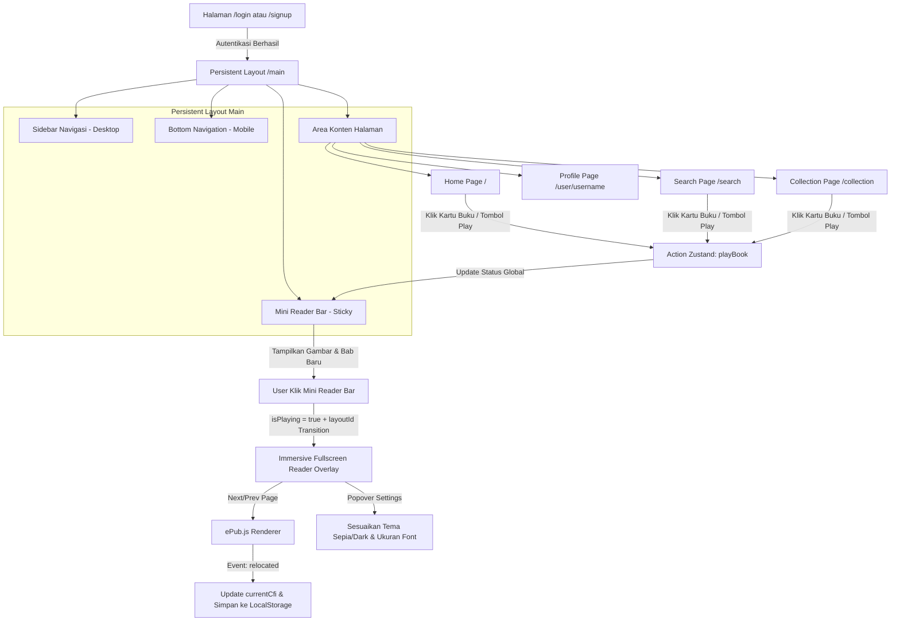

# 🎨 Bookify Project Implementation Plan

Dokumen ini adalah cetak biru (blueprint) profesional dan terorganisir untuk membangun **Bookify**, sebuah aplikasi pembaca buku EPUB berbasis web dengan antarmuka premium dan alur kerja yang mengadopsi estetika serta pengalaman pengguna mirip **Spotify**.

---

## 1. 🖼️ Desain UI & Estetika Premium (Spotify-Inspired)

Aplikasi ini dirancang dengan gaya serba gelap (*dark-mode primary*) yang elegan untuk memberikan kenyamanan membaca maksimal bagi pengguna serta tampilan yang modern dan premium.

### A. Palet Warna & Identitas Visual
*   **Background Utama (Canvas):** `#121212` (Hitam pekat khas Spotify untuk mengurangi kelelahan mata).
*   **Background Panel/Kartu:** `#181818` (Abu-abu sangat gelap untuk membedakan kartu buku dan sidebar dari latar belakang).
*   **Hover State:** `#282828` (Warna abu-abu terang untuk efek hover yang halus pada kartu atau baris).
*   **Warna Aksen Utama:** Gradien dinamis dari Ungu Neon (`#9333EA`) ke Pink Neon (`#EC4899`), serta warna Hijau Spotify (`#1DB954`) untuk tombol *Play* dan indikator aktif.
*   **Teks:** Putih bersih (`#FFFFFF`) untuk judul utama, dan abu-abu terang (`#A7A7A7`) untuk deskripsi atau nama penulis.

### B. Tipografi & Tata Letak Responsif
*   **Font Utama:** Menggunakan **Outfit** atau **Inter** dari Google Fonts untuk memberikan kesan bersih, bulat, dan ramah pengguna.
*   **Layout Desktop:**
    *   **Sidebar (Kiri):** Lebar statis `w-64` (256px), menampung logo Bookify, menu navigasi utama (Home, Search, Library), dan daftar playlist buatan pengguna.
    *   **Konten Utama (Kanan):** Scrollable container dengan padding besar (`p-8`), menampilkan greeting dinamis dan grid buku.
    *   **Mini Reader (Bawah):** Menempel secara melayang (*sticky*) di bagian paling bawah layar.
*   **Layout Mobile:**
    *   **Konten Utama:** Menempati seluruh lebar layar.
    *   **Bottom Navigation:** Melayang di bawah setebal `h-16` (64px) untuk navigasi jempol yang ergonomis.
    *   **Mini Reader:** Tepat di atas bottom navigation dengan efek blur transparan (*glassmorphism*).

---

## 2. 🗺️ Alur Diagram Sistem Secara Keseluruhan (Overall System Flow)

Diagram di bawah ini menggambarkan perjalanan pengguna serta aliran status data global (*Zustand Store*) mulai dari penelusuran buku hingga pembukaan pembaca imersif layar penuh.



---

## 3. 🧩 Spesifikasi Fungsi Per Halaman & Komponen (Feature & Component Specs)

Setiap bagian aplikasi dirancang untuk memiliki fungsi interaktif mandiri yang terhubung dengan status pembaca global.

### A. Autentikasi (`/login` & `/signup`)
*   **Tampilan:** Layar minimalis hitam pekat dengan kartu formulir di bagian tengah. Tombol input berdesain melingkar penuh (*rounded-full*).
*   **Fungsi:** Validasi formulir standar pada client-side. Transisi halaman menggunakan Framer Motion `<motion.div>` dengan efek geser horizontal (*slide-slide*) dan pemudaran (*fade-in/out*) yang mulus.

### B. Beranda (`/`)
*   **Greeting Dinamis:** Sistem mendeteksi jam sistem lokal dan menampilkan sapaan dinamis (Pagi: 05:00-11:59 | Siang: 12:00-15:59 | Sore: 16:00-18:59 | Malam: 19:00-04:59).
*   **Quick Shortcuts Grid:** Grid berisi 6 buku teratas yang paling sering dibaca. Saat disorot cursor (*hover*), tombol lingkaran hijau *Play* mini akan muncul dengan animasi membesar (*scale-up*).
*   **Continue Reading Section:** Kartu hero lebar yang memuat satu buku terakhir dengan detail progres persentase membaca dan progress bar visual di bawahnya.

### C. Pencarian & Eksplorasi (`/search` & `/search/[genreId]`)
*   **Live Search Bar:** Input pencarian yang secara instan menyaring data `mockBooks` berdasarkan nama penulis atau judul buku tanpa memicu pemuatan ulang halaman (*reload*).
*   **Genre Color Grid:** CSS Grid yang menampilkan kategori buku dengan gaya kartu Spotify, lengkap dengan latar belakang warna gradien yang miring (`bg-gradient-to-br from-purple-600 to-pink-500`) dan gambar sampul mini yang diputar miring di sudut kanan bawah kartu.

### D. Koleksi Pribadi (`/collection`)
*   **Liked Books:** Tab khusus untuk menyaring dan menampilkan buku yang disukai oleh pengguna berdasarkan daftar ID buku yang disimpan dalam store global.
*   **Daftar Putar Buku (Reading List):** Fungsionalitas untuk membuat daftar khusus (layaknya Playlist lagu) di mana pengguna dapat menambah atau mengeluarkan buku.

### E. Profil Pengguna (`/user/[username]`)
*   **Statistik Membaca:** Menampilkan ringkasan data aktivitas seperti "Total Menit Membaca" dan "Jumlah Buku Selesai".
*   **Avatar Interaktif:** Avatar berbentuk melingkar yang jika disorot cursor (*hover*) akan menampilkan overlay transparan hitam dengan ikon kamera untuk mengubah foto profil.

### F. Mini Reader Bar (State: Terbuka Minim)
*   **Wujud Visual:** Bar melayang berdesain *glassmorphism* di atas navigasi bawah. Menampilkan cover buku mini, teks berjalan judul bab, tombol tutup, dan tombol putar/jeda.
*   **Progress Indikator:** Garis tipis setebal 2px di bagian atas bar yang menunjukkan seberapa jauh buku telah dibaca (0% - 100%).

### G. Immersive Fullscreen Reader (State: Terbuka Penuh)
*   **Efek Transisi (Shared Layout):** Ketika Mini Reader diklik, ia akan memicu transisi Framer Motion dengan properti `layoutId="reader-container"`. Elemen bar kecil akan membesar secara mulus hingga memenuhi layar, memberikan sensasi visual yang sangat mewah.
*   **Sistem Navigasi ePub.js:** Navigasi halaman menggunakan tombol virtual (Kiri & Kanan) serta tombol keyboard panah yang memicu `rendition.prev()` dan `rendition.next()`.
*   **Pengaturan Teks (Popover):** Panel melayang dari bawah (*bottom-sheet*) untuk mengubah ukuran font kontainer ePub.js serta beralih antara tema Light (kertas putih), Sepia (kertas kuning hangat), dan Dark (kertas abu-abu gelap).

---

## 4. 🚀 8 Fase Implementasi Terstruktur (Technical Execution)

### Fase 1: Inisialisasi Proyek & Konfigurasi Dasar
*   Menginisialisasi proyek Next.js 15+ dengan TypeScript, ESLint, dan Tailwind CSS.
*   Instalasi pustaka eksternal utama:
    ```bash
    npm install zustand framer-motion lucide-react epubjs
    ```
*   Konfigurasi `globals.css` untuk mendaftarkan variabel warna tema gelap.

### Fase 2: Skema Mock Data & Persiapan Aset EPUB
*   Membuat berkas `src/data/mockData.ts` yang berisi definisi tipe data dan array buku statis lokal.
*   Menyiapkan direktori aset statis di `public/books/` untuk file `.epub` dan `public/covers/` untuk gambar cover buku.

### Fase 3: Struktur Navigasi Global & Persistent Layout
*   Membangun folder grup rute `(main)` dan membuat berkas `layout.tsx` di dalamnya.
*   Membuat komponen `Sidebar` desktop dan `BottomNav` perangkat mobile dengan desain melayang (*fixed position*).

### Fase 4: Integrasi Zustand Global Store
*   Membangun berkas `src/store/useReaderStore.ts`.
*   Mengaktifkan *Zustand Persist Middleware* dengan penyimpanan `localStorage` agar status pembacaan aman dari pemuatan ulang halaman (*page reload*).

### Fase 5: Implementasi Halaman Dashboard Utama
*   Membangun halaman Home dengan greeting dinamis dan section continue reading.
*   Membangun halaman Search dengan bar pencarian live dan grid kategori gradien.
*   Membangun halaman Collection dengan tab filter buku favorit.

### Fase 6: Mini Reader Bar & Shared Layout Transition
*   Membuat komponen `MiniReaderBar.tsx` dengan efek glassmorphism transparan.
*   Mengintegrasikan Framer Motion `layoutId="reader-container"` untuk menyambungkan Mini Reader ke layar penuh.

### Fase 7: Immersive Fullscreen Reader & Integrasi ePub.js
*   Membuat komponen `FullscreenReader.tsx` menggunakan Next.js `dynamic` import dengan opsi `ssr: false`.
*   Membuat instansiasi render ePub.js ke elemen DOM `#epub-viewer` serta menghubungkan event listener `relocated` untuk menangkap string koordinat `CFI`.

### Fase 8: Sempurnakan Detail Visual & Mikro-Animasi (Polish)
*   Membuat popover panel setelan font dan tema pembaca.
*   Menambahkan animasi transisi halaman rute menggunakan komponen `<AnimatePresence>` dari Framer Motion.

---

## 5. 🛠️ Detail Arsitektur Kode & Teknis Lainnya

### A. Skema Global State (Zustand)
```typescript
interface Book {
  id: string;
  title: string;
  author: string;
  coverUrl: string;
  epubUrl: string;
  genreId: string;
}

interface ReaderState {
  currentBook: Book | null;
  currentCfi: string | null;
  currentChapterTitle: string;
  isPlaying: boolean; // Menandakan apakah fullscreen reader terbuka
  progressPercent: number;
  theme: 'dark' | 'sepia' | 'light';
  fontSize: number; // dalam persen, misal: 100 (16px)
  
  playBook: (book: Book) => void;
  pauseBook: () => void;
  updateProgress: (cfi: string, percent: number, chapterTitle: string) => void;
  setTheme: (theme: 'dark' | 'sepia' | 'light') => void;
  setFontSize: (size: number) => void;
}
```

### B. Penanganan Masalah SSR epub.js di Next.js
Karena `epub.js` mengandalkan objek DOM global browser, kita wajib merender komponen pembaca dengan cara memotong proses Server-Side Rendering (SSR):

```typescript
// src/components/reader/ReaderWrapper.tsx
import dynamic from 'next/dynamic';

const EpubViewer = dynamic(
  () => import('./EpubViewer'),
  { 
    ssr: false, 
    loading: () => (
      <div className="flex h-full w-full items-center justify-center bg-[#121212]">
        <div className="animate-spin rounded-full h-10 w-10 border-t-2 border-green-500" />
      </div>
    )
  }
);

export default function ReaderWrapper() {
  return <EpubViewer />;
}
```

### C. Rencana Verifikasi Kualitas
1.  **Build Check:** Menjalankan `npm run build` untuk memastikan kompilasi berkas Next.js tidak terganggu oleh kode Client-side.
2.  **UX Testing (Framerate):** Memastikan transisi shared-layout Framer Motion dari Mini Reader ke Fullscreen Reader berjalan lancar mendekati 60fps tanpa lagging pada perangkat mobile menengah.
3.  **Persistence Testing:** Menggeser halaman buku di Fullscreen Reader, menyegarkan browser (*refresh*), lalu menguji apakah halaman dimuat ulang di bagian buku yang tepat dengan CFI yang sama.
